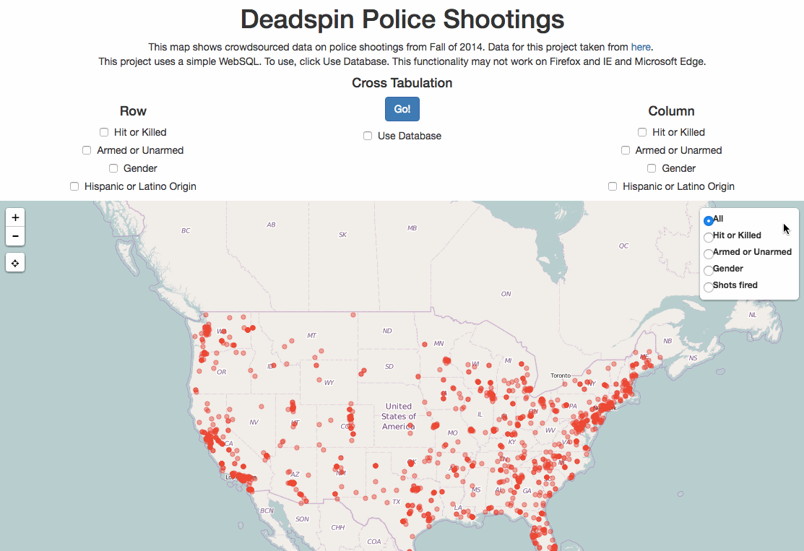
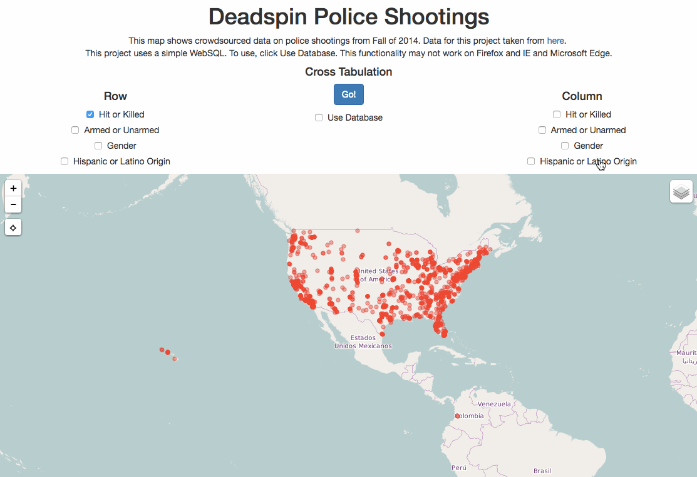

- Police Shootings: policeshootings.html

* [Sample Starter Repo](https://github.com/mkfreeman/police-shooting)

* [Download Google Docs Excel as JSON](http://blog.pamelafox.org/2013/06/exporting-google-spreadsheet-as-json.html)
* [Police Shooting data](https://docs.google.com/spreadsheets/d/1cEGQ3eAFKpFBVq1k2mZIy5mBPxC6nBTJHzuSWtZQSVw/edit#gid=1144428085)
* [A repo I referenced](https://github.com/JoeMeas/police-shooting)

**Aims**
* Leaflet map of US 
* Read data from JSON file 
* Different map layers 
* Sidebar selection filter 
* Cross tabulation
* WebSQL Database and cross tabulation

**Map Image**

**Table Image**
