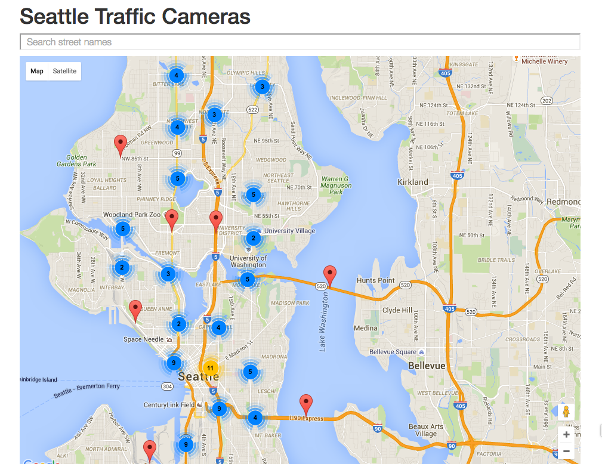
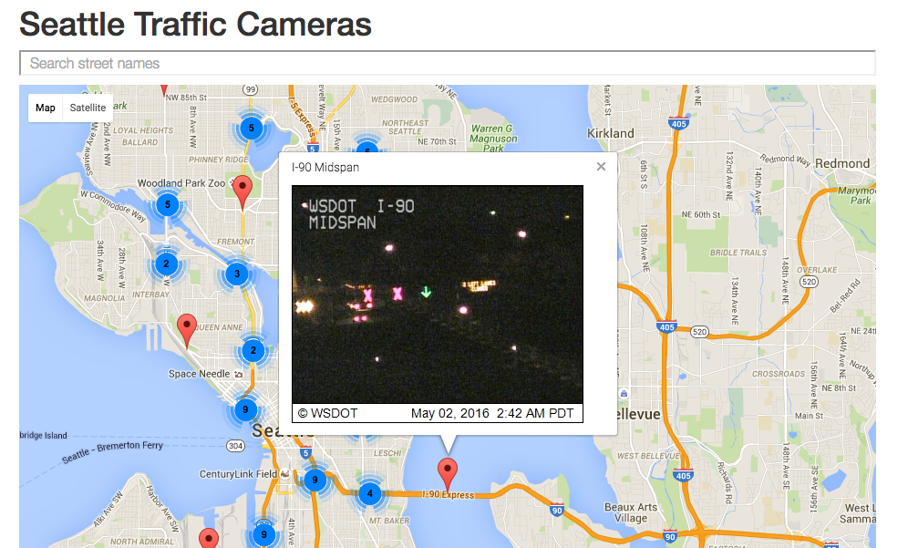

# Seattle Traffic Camera Challenge

* [Challenge webpage](http://courses.washington.edu/info343/morris/assignments/components.shtml)
* [A Reference Repo](https://github.com/JoshMalters/traffic-cam-challenge)
* [List of Seattle Traffic Cameras](http://data.seattle.gov/resource/65fc-btcc.json)

**Aims**
- Link with Google Maps 
- Get Traffic Camera image feed 
- Add search bar for filter
- Marker clustering on map

**Images**

